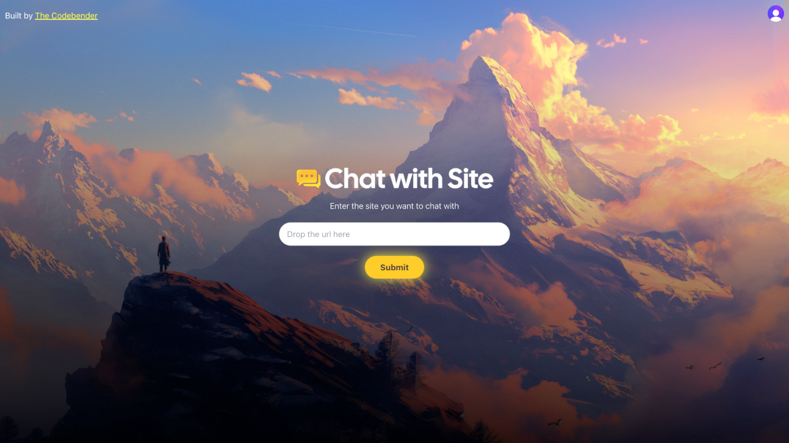

# Chat with any website

> ⚡️ This app was built as part of a challenge in the **Codebender AI Bootcamp**. Learn how to build projects like these [here](https://lastcodebender.com/bootcamp).

This app allows you to chat with any website.



The app is built with Next.js. It uses Puppeteer to scrape the website and the NVIDIA Nim API with the `mixtral-8x7b-instruct-v0.1` AI model to chat with the site.

## Author

This project is built by The Codebender [𝕏](https://twitter.com/ZaurbekStark)/[YouTube](https://www.youtube.com/@thecodebendermaster)

## Getting Started

First, duplicate the `.env` file into a new file named `.env.local`. Update the dummy values: [NVIDIA Nim API](https://build.nvidia.com/explore/discover), [Clerk](https://clerk.com/docs/upgrade-guides/api-keys), and [ScrapingAnt](https://app.scrapingant.com/dashboard) keys.

The first time you are running this project, you will need to install the dependencies. Run this command in your terminal:

```bash
yarn
```

To start the app, run:

```bash
yarn dev
```

Open [http://localhost:3000](http://localhost:3000) with your browser to see the result.

You can start editing the page by modifying `app/page.tsx`. The page auto-updates as you edit the file.
